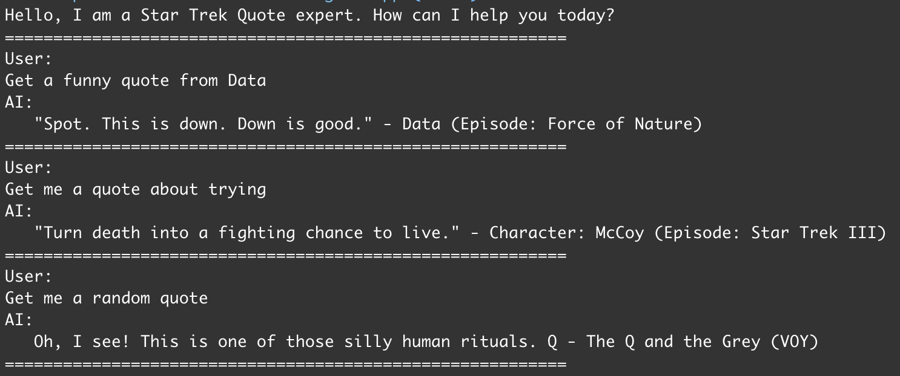

# RAG (Retrieval-Augmented Generation) Chat Application

A console-based chat application where star-trek quotes are used as a knowledge base. It demonstrates how to build a
RAG (Retrieval-Augmented Generation) application from scratch

## Running the SimpleChatApp

```bash
cd RagChatApp
dotnet run
```

The application will start and you can begin chatting with the AI assistant.
The assistant is configured to help you find relevant Star Trek quotes based on your input.

### Usage



## Change the model

You can change model by modifying the `appsettings.json` file in the `RagChatApp` directory. Change the `ChatModel` or
`EmbeddingModel` and remember to download the model with ollama using `ollama pull <model-name>` before running the app.

## Credits

Quotes from https://codepen.io/JeanRC/details/oLJMeo